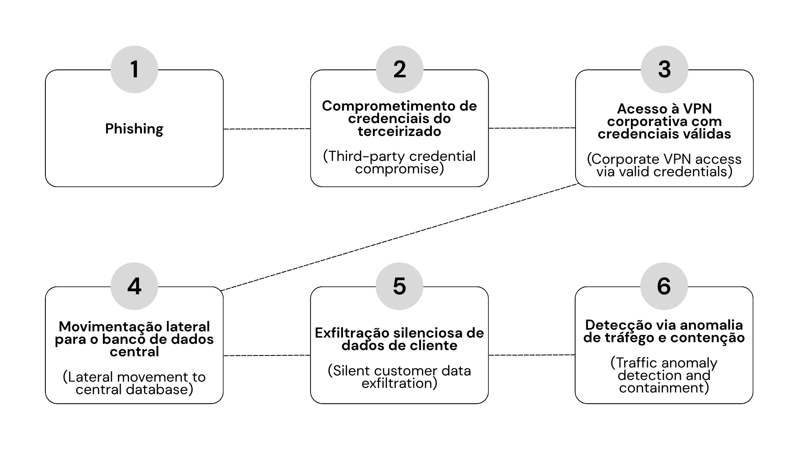

# Projects - Mujer Digital 2026

 

> **Boas-vindas!** Este repositório reúne os mini-projetos e estudos de caso desenvolvidos durante o programa Mujer Digital 2026 para prática de conceitos de cibersegurança.  
> *Clique nos botões de idioma acima ou navegue pelos índices abaixo para ir direto para o idioma/projeto desejado.*

> **Welcome!** This repository brings together hands-on mini-projects and case studies developed during the Mujer Digital 2026 program to practice cybersecurity concepts.  
> *Click the language buttons above or use the indexes below to jump directly to your preferred language/project.*

---

## Versão em Português

### Índice de Projetos

| Tipo | Projeto / Caso | Tópicos Chave | Link de Atalho |
| :---: | :--- | :--- | :---: |
| Estudo de Caso | **Caso: Invasão e Vazamento de Dados na NTT DOCOMO** | Supply Chain Attack, Phishing, Zero Trust | [Ir para Projeto](#caso-invasão-e-vazamento-de-dados-na-ntt-docomo-pt) |

---

### Caso: Invasão e Vazamento de Dados na NTT DOCOMO (PT)

<b>Ver Estudo de Caso Completo</b>

#### 1. Tipo de Incidente
Roubo e fuga de dados (*data breach*) viabilizado por ataque à cadeia de suprimentos (*supply chain attack*) e comprometimento de credenciais corporativas.

#### 2. Sobre a Empresa
A NTT DOCOMO é a maior operadora de telecomunicações móveis do Japão, pertencente ao grupo NTT (Nippon Telegraph and Telephone). Ela processa e armazena dados de dezenas de milhões de cidadãos japoneses, incluindo informações pessoais sensíveis e dados financeiros para faturamento.

#### 3. O que Aconteceu
Houve um ataque de *phishing* — criminosos se passam por outra pessoa ou empresa confiável para enganar e roubar dados sensíveis —, onde os atacantes não invadiram os servidores centrais da empresa diretamente. Em vez disso, comprometeram as credenciais de acesso de um funcionário de uma empresa parceira de TI que possuía acesso privilegiado aos sistemas de manutenção da operadora. 

Sem autenticação multifator (MFA) rigorosa no ambiente parceiro, os atacantes usaram esses acessos legítimos para extrair dados do banco de dados de clientes sem levantar alertas imediatos.

#### 4. Impacto
- **Operacional e Financeiro:** Necessidade de notificação massiva a clientes, custos com perícia forense, auditoria externa e reestruturação da infraestrutura de TI terceirizada.
- **Reputacional:** Exposição de milhões de registros de clientes e dados de contas, gerando perda de confiança pública na maior operadora do país.
- **Regulatório:** Investigação e sanções severas impostas pelo Ministério dos Assuntos Internos e Comunicações (MIC) do Japão por falha na supervisão de subcontratados.

#### 5. Conceitos Identificados
- **Engenharia Social / Phishing:** Manipulação de pessoas para entregar dados confidenciais ou credenciais de acesso.
- **Princípio do Menor Privilégio (Least Privilege):** Prática de conceder a um usuário ou sistema apenas as permissões estritamente necessárias para realizar suas tarefas diárias.
- **Exfiltração de Dados:** Transferência ou cópia não autorizada de informações confidenciais de dentro da rede corporativa para um ambiente externo controlado pelo invasor.
- **Zero Trust:** Modelo de segurança baseado na premissa de sempre exigir autenticação e validação contínuas para qualquer usuário ou dispositivo.

#### 6. Profissionais de Cibersegurança Envolvidos
- **Analistas SOC (Centro de Operações de Segurança):** Identificaram o volume anômalo de dados sendo transferidos fora do horário comercial.
- **Peritos em Forense Computacional:** Rastrearam a origem dos acessos até as credenciais do funcionário terceirizado e analisaram logs para determinar a extensão do vazamento.
- **Equipe de Engenharia de Redes:** Revogaram imediatamente os acessos comprometidos, redefiniram segredos e isolaram os segmentos de rede afetados.
- **Encarregado de Proteção de Dados e Relações Públicas:** Comunicação oficial com os clientes afetados e reporte às autoridades reguladoras japonesas.

#### 7. Processo de Resposta a Incidentes
- **Preparação:** Estabelecer políticas rígidas de acesso para terceiros e implementar MFA obrigatório em todas as conexões remotas.
- **Identificação:** Monitorar logs de autenticação e usar ferramentas de detecção de comportamentos anômalos.
- **Contenção:** Bloquear a conta do prestador, cortar a conexão VPN do parceiro e isolar os servidores de banco de dados afetados.
- **Erradicação:** Remover qualquer *backdoor* que possa ter sido instalado e redefinir todas as credenciais do ambiente de TI.
- **Recuperação:** Restabelecer a operação com rotinas adicionais de monitoramento e auditoria em tempo real sobre acessos privilegiados.
- **Lições Aprendidas:** Revisar contratos de segurança com parceiros e realizar novas auditorias de conformidade.

#### 8. Ferramentas Usadas
- **SIEM (Gerenciamento de Informações e Eventos de Segurança):** Coleta e análise de logs para correlação dos eventos do ataque.
- **PAM (Gestão de Acessos Privilegiados):** Gestão e auditoria de acessos de contas com privilégios elevados.
- **EDR / MDR (Detecção e Resposta em Endpoints):** Monitoramento contínuo de endpoints e servidores para identificar movimentação lateral.
- **DLP (Prevenção contra Perda de Dados):** Ferramentas para prevenir o envio de arquivos confidenciais para fora da rede.

[Λ Voltar ao topo](#projects---mujer-digital-2026)

---

## English Version

### Project Index

| Type | Project / Case Study | Key Topics | Shortcut Link |
| :---: | :--- | :--- | :---: |
| Case Study | **NTT DOCOMO Data Breach & Supply Chain Case** | Supply Chain Attack, Phishing, Zero Trust | [Go to Project](#ntt-docomo-data-breach--supply-chain-case-en) |

---

### NTT DOCOMO Data Breach & Supply Chain Case (EN)

<b>View Full Case Study</b>

#### 1. Incident Type
Data theft and exfiltration (data breach) facilitated by a supply chain attack and compromised corporate credentials.

#### 2. About the Company
NTT DOCOMO is Japan's largest mobile telecommunications operator, part of the NTT (Nippon Telegraph and Telephone) Group. It processes and stores data for tens of millions of Japanese citizens, including sensitive personal information and financial billing data.

#### 3. What Happened
An adversary launched a phishing attack to steal credentials. Rather than breaching the operator's core infrastructure directly, attackers compromised access credentials belonging to an employee at a third-party IT vendor with elevated access to operational systems.

Lacking strict Multi-Factor Authentication (MFA) on the vendor environment, the threat actors leveraged legitimate access to exfiltrate customer database records without triggering immediate security alerts.

#### 4. Impact
- **Operational & Financial:** Mandatory mass customer notifications, forensic investigation expenses, external audits, and third-party IT infrastructure restructuring.
- **Reputational:** Exposure of millions of customer records, leading to public trust loss in the country's primary operator.
- **Regulatory:** Investigations and sanctions imposed by Japan's Ministry of Internal Affairs and Communications (MIC) for inadequate third-party oversight.

#### 5. Identified Concepts
- **Social Engineering / Phishing:** Deceptive techniques used to manipulate individuals into disclosing sensitive data or login credentials.
- **Least Privilege Principle:** Restricting user and system permissions strictly to what is required for daily operational roles.
- **Data Exfiltration:** Unauthorized transfer or copying of sensitive information from corporate networks to attacker-controlled infrastructure.
- **Zero Trust Architecture:** A security model requiring continuous authentication and validation for all users and endpoints.

#### 6. Cybersecurity Roles Involved
- **SOC Analysts:** Detected anomalous data transfer volumes outside business hours.
- **Digital Forensics Investigators:** Traced access logs back to the third-party employee credentials to determine breach scope.
- **Network Engineering Team:** Immediately revoked compromised accounts, rotated secrets, and isolated affected network segments.
- **Data Protection Officer & PR:** Conducted public disclosures to impacted users and regulatory reporting.

#### 7. Incident Response Lifecycle
- **Preparation:** Enforce strict vendor access controls and mandate MFA across all remote access vectors.
- **Identification:** Monitor authentication telemetry and leverage behavior anomaly detection systems.
- **Containment:** Disable the vendor user account, terminate partner VPN tunnels, and isolate impacted database servers.
- **Eradication:** Scan and remove potential backdoors while resetting infrastructure-wide credentials.
- **Recovery:** Restore services with heightened real-time auditing and monitoring on privileged access.
- **Lessons Learned:** Overhaul partner security contracts and execute third-party compliance audits.

#### 8. Tools Used
- **SIEM (Security Information and Event Management):** Log collection and correlation to map attack telemetry.
- **PAM (Privileged Access Management):** Controlling and auditing high-privilege account sessions.
- **EDR / MDR (Endpoint Detection and Response):** Continuous monitoring across endpoints to detect lateral movement.
- **DLP (Data Loss Prevention):** Enforcing rules to prevent unauthorized file transfers outside the network boundary.

[Λ Voltar ao topo](#projects---mujer-digital-2026)
